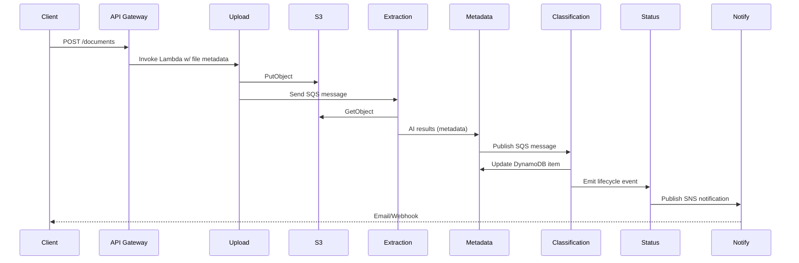

# Architecture Overview

## Objective
Build a cloud-native Smart Document Processing & Retrieval System on AWS using 8–12 microservices. Users upload documents, AI agents extract metadata, DynamoDB stores searchable records, and notifications are emitted once processing completes.

## Core AWS Services
| Layer | AWS Service | Responsibility |
| --- | --- | --- |
| Ingress | Amazon API Gateway | Authenticated REST endpoints for upload, search, and status queries. |
| Storage | Amazon S3 | Durable storage for original documents and derived assets. |
| Compute | AWS Lambda | Each microservice runs as a discrete Lambda function. |
| Orchestration | Amazon SQS / SNS | Queue-based decoupling between upload → extraction → classification; fan-out notifications. |
| Database | Amazon DynamoDB | `DocumentsTable` (metadata + status) and `EventsTable` (status history + analytics). |
| AI Integration | Amazon Bedrock / OpenAI API | Invoked from extraction Lambda for summarization & metadata generation. |

## Microservice Inventory
1. **API Gateway Service** – Routes HTTPS traffic to backend Lambdas.
2. **Upload Service** – Accepts uploads, stores raw file in S3, and publishes an extraction job.
3. **Storage Service** – Owns S3 bucket policies, lifecycle rules, and signed URL issuance.
4. **Extraction Service** – Downloads files, calls AI agent, emits normalized metadata.
5. **Metadata Service** – Writes extracted fields to DynamoDB and emits status events.
6. **Classification Service** – Applies AI/rule-based classification and tagging.
7. **Search Service** – Provides keyword/category filtering backed by DynamoDB GSIs.
8. **Notification Service** – Pushes SNS/email/webhook alerts when processing finishes.
9. **Status Service** – Maintains event-sourced history per document for UI timelines.
10. **Analytics Service** – Aggregates metrics (processing latency, failure rate) and stores aggregates.

## Event Flow

## Security & Operations
- **IAM**: Each Lambda has least-privilege policies (S3:GetObject, DynamoDB:UpdateItem, etc.).
- **Observability**: CloudWatch Logs + embedded metrics for latency and errors.
- **Resilience**: Dead-letter queues configured for each processing queue; automatic retries on transient failures.
- **Cost Control**: Lifecycle policies to archive processed files after 30 days; DynamoDB TTL on event history.

## Future Enhancements
- Multi-region DynamoDB Global Tables for DR.
- Step Functions orchestration for long-running workflows.
- Real-time WebSocket notifications for the frontend dashboard.
